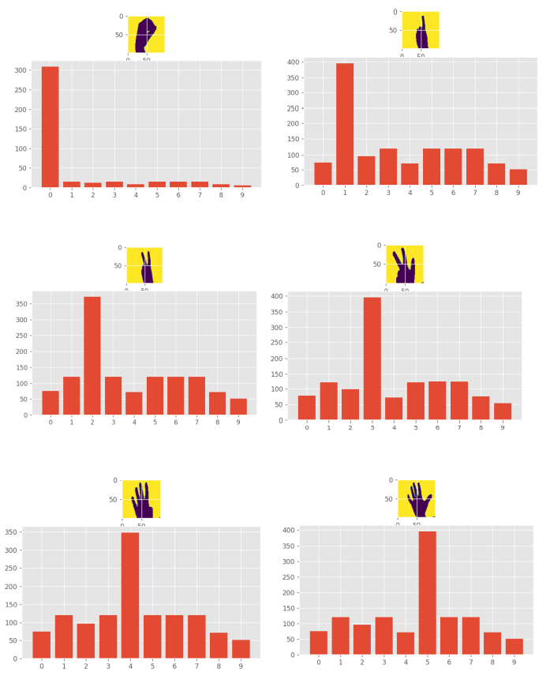

# ASL Number Recognition: CP-468 AI Final Project

The official repository of the ASL Number Recognition for the CP-468 final project. The following *Readme* file gives an overview about this project.

ASL (American Sign Language) is the most used sign language. A huge portion of the population has not learnt this language creating a language barrier for the mute people. This project aims to  recognize the numbers of the ASL by comparing the pixels of the image being tested to the images’ dataset.


### Author

[Dhruv Sagar](https://github.com/dhruvel)


### Dataset

The dataset used can be found on [this](https://github.com/ardamavi/Sign-Language-Digits-Dataset) github link. It is a collection of images of the ASL numbers. I further converted these images into black and white in order to use them with my code.

### Installation and Execution

1. Clone this repository to your Local Machine using the following command:

   ```
   git clone https://github.com/dhruvel/CP468---AI-Final-Project---ASL-Number-Recognition
   ```

2. Install the Python 3.10.5 on your machine.

3. Now install the dependencies. The list is as follows:

   - Numpy

   - Matplotlib

   - Collection

   - Pillow

     For windows use the following in the cmd:

   ```
   pip install numpy
   pip install matplotlib
   pip install collection
   pip install Pillow
   ```

4. Open Terminal of your Local Machine and change directory to the one where the files are cloned using the command. For windows it would be as follows:

   ```
   cd <repo directory>
   ```

5. Now run the ASL.py file using the terminal. For windows use the following command:

   ```
   python ASL.py
   ```

6. GGEZ! You are done. 


### Results




