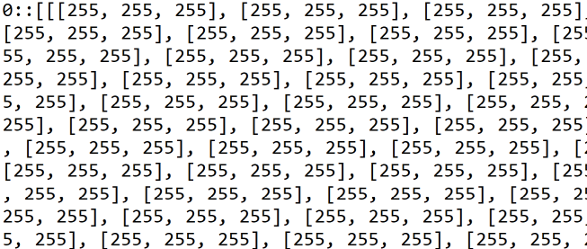
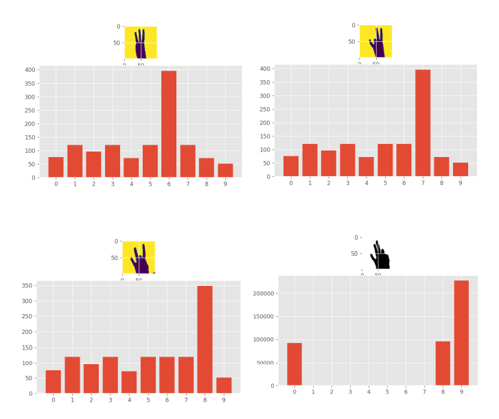
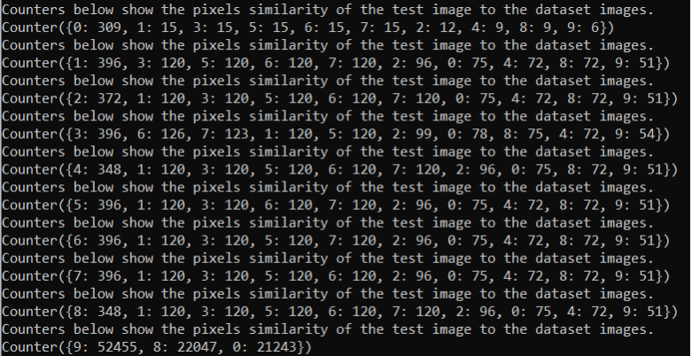

# ASL Number Recognition: CP-468 AI Final Project

The official repository of the ASL Number Recognition for the CP-468 final project. The following *Readme* file gives an overview about this project.

ASL (American Sign Language) is the most used sign language. A huge portion of the population has not learnt this language creating a language barrier for the mute people. This project aims to  recognize the numbers of the ASL by comparing the pixels of the image being tested to the images’ dataset.


### Author

[Dhruv Sagar](https://github.com/dhruvel)


### Dataset

The dataset used can be found on [this](https://github.com/ardamavi/Sign-Language-Digits-Dataset) github link. It is a collection of images of the ASL numbers. I further converted these images into black and white in order to use them with my code.

### Installation and Execution

1. Clone this repository to your Local Machine using the following command:

   ```
   git clone https://github.com/dhruvel/CP468---AI-Final-Project---ASL-Number-Recognition
   ```

2. Install the Python 3.10.5 on your machine.

3. Now install the dependencies. The list is as follows:

   - Numpy

   - Matplotlib

   - Collection

   - Pillow

     For windows use the following in the cmd:

   ```
   pip install numpy
   pip install matplotlib
   pip install collection
   pip install Pillow
   ```

4. Open Terminal of your Local Machine and change directory to the one where the files are cloned using the command. For windows it would be as follows:

   ```
   cd <repo directory>
   ```

5. Now run the ASL.py file using the terminal. For windows use the following command:

   ```
   python ASL.py
   ```

6. GGEZ! You are done. 


### Methodology

I used the Zoning Method for the recognition. The zoning method divides the image into zones while utilizing the density feature. Calculating the percentage of black pixels is similar to calculating density. But in this case, it is determined for each zone. During the training phase, the symbol's features are retrieved, and the associated symbol is then found.

To train the code and build the arrays of the dataset's characteristics. We determined how many black pixels were present in each image in the collection. To accomplish this, we defined formingData() and kept the values in a text file.

The information was then presented as follows in the txt file:




### Results

When determined the data's average and compared it to the inputted test image. It would 
compare the values and show which dataset values correspond to those in the test image. With the use of a bar graph, we displayed the data and demonstrated which values were most close to the picture. 




The counters for the comparison to each number can also be found in the terminal like below: 




### Conclusion

In conclusion, the accuracy of the algorithm is pretty solid, where the results are almost always accurate. Since all the peaks within the results point out to the correct values, it can easily be used for real life applications without having to worry about inaccuracies. 


### License

The details of the license can be found in the License.txt file in the repository.


### Performance Parameters:

I have used the following performance parameters during the project. I have also reflected and rated myself in those parameters: 

- **Cycle Time**: How much time do each project stage takes.
  I have spent the proper allocated time for each stage except the database gathering stage. Thus, I rate myself 8/10 for it.
- **Velocity**: The amount of work I could complete in a given amount of time.
  I was able to complete most of my work before the personally set deadlines. Thus, I rate myself 8/10 for it.
- **Work-in-progress**: The state of the work in progress.
  When working on the project I had other ongoing projects on the side which could have acted as bottlenecks. But it did not hinder my work for this project. Thus, I rate myself 10/10 for it.
- **Failure rate**: How often did I face failure while working on the project.
  I had to decide one of the 3 methods in order to make the project work. I had also faced a variety of issues while coding. Thus, I rate myself 7/10 on it.
